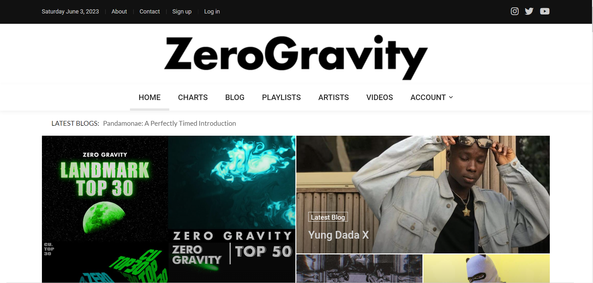

# ZG Music

 
 

<table>
  <tr>
    <td></td>
    <td></td>
  </tr>
</table>
 

 

<b>A Music Entertainment app</b>

 

## ➡️ Description
This is a music/entertainment app built with html, css and python using the web development framework Django. 
The project is deployed on pythonanywhere - [ZeroGravity](https://zerogravity.pythonanywhere.com) 
It is an improvement to a previous web app developed by me - [Musicblog-flask](https://github.com/ademolaidowu/musicblog-flask). 

## ➡️ Features
* Better UI experience and responsiveness
* View music charts, tables, playlists, artists and videos
* View and search blog posts and comment if you like
* Register user for an account
* Log in into account
* Update account profile information
* Upload ads on website
* Upload songs for verification
* Log out from account
* About and Contact us page
* Newsletter subscription
  

## ➡️ Languages | Technologies
<table>
  <tr>
    <td>Programming Languages</td>
    <td>Python</td>
  </tr>
  <tr>
    <td>Backend</td>
    <td>Django</td>
  </tr>
  <tr>
    <td>Frontend</td>
    <td>HTML, CSS, Javascript, Bootstrap</td>
  </tr>
  <tr>
    <td>Database</td>
    <td>Sqlite3</td>
  </tr>
</table>
 

## ➡️ Installation
* Clone or download this repository
* Ensure python is installed on your system
* Create virtual environment in parent directory, run `python -m venv venv`
* Activate environment, for bash run `source venv/Scripts/activate`
* Install project packages, run `pip install -r requirements.txt`
* Create a .env file and set values for **SECRET_KEY**, **MAIL_USERNAME** AND **MAIL_PASSWORD**
* Migrate database models, run `python manage.py makemigrations`, then `python manage.py migrate`
* Finally start the app, run `python manage.py runserver`
 

## ➡️ Contribution/Improvement
* To improve on this, reset and change password features should be included